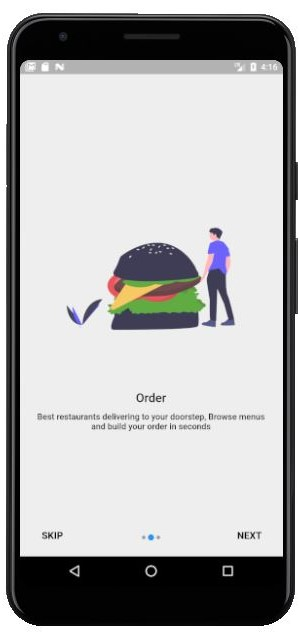
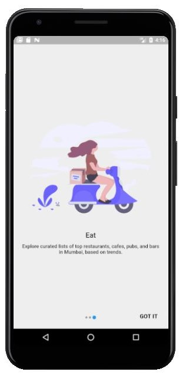

# flutter onboarding screen

A new Flutter package for both android and iOS which help developer in creating a onboarding screen of their app.


## Screenshots

    

## Usage


[Example](https://github.com/champ96k/flutter-onboarding-screen/blob/master/example/example_app.dart)

To use this package :

* add the dependency to your [pubspec.yaml](https://github.com/champ96k/flutter-onboarding-screen/blob/master/pubspec.yaml) file.

```yaml
  dependencies:
    flutter:
      sdk: flutter
    flutter_onboarding_screen:
```

### How to use

```dart
class TestScreen extends StatelessWidget {
    /*here we have a list of OnbordingScreen which we want to have, each OnbordingScreen have a imagePath,title and an desc.
      */
  final List<OnbordingData> list = [
    OnbordingData(
      imagePath: "images/pic11.png",
      title: "Search",
      desc:"Discover restaurants by type of meal, See menus and photos for nearby restaurants and bookmark your favorite places on the go",
    ),
    OnbordingData(
      imagePath: "images/pic12.png",
      title: "Order",
      desc:"Best restaurants delivering to your doorstep, Browse menus and build your order in seconds",
    ),
    OnbordingData(
      imagePath: "images/pic13.png",
      title: "Eat",
      desc:"Explore curated lists of top restaurants, cafes, pubs, and bars in Mumbai, based on trends.",
    ),
  ];

  @override
  Widget build(BuildContext context) {
  //here we need to pass the list and the route for the next page to be opened after this.
    return new IntroScreen(list,MaterialPageRoute(builder: (context) => TestScreen()),
    );
  }
}
```

### Created & Maintained By

[Tushar Nikam](https://github.com/champ96k) ([@champ_96k](https://twitter.com/champ_96k)) 
([linkedin](https://www.linkedin.com/in/tushar-nikam-a29a97131/))


## Getting Started

For help getting started with Flutter, view our online [documentation](https://flutter.io/).

For help on editing package code, view the [documentation](https://flutter.io/developing-packages/).

